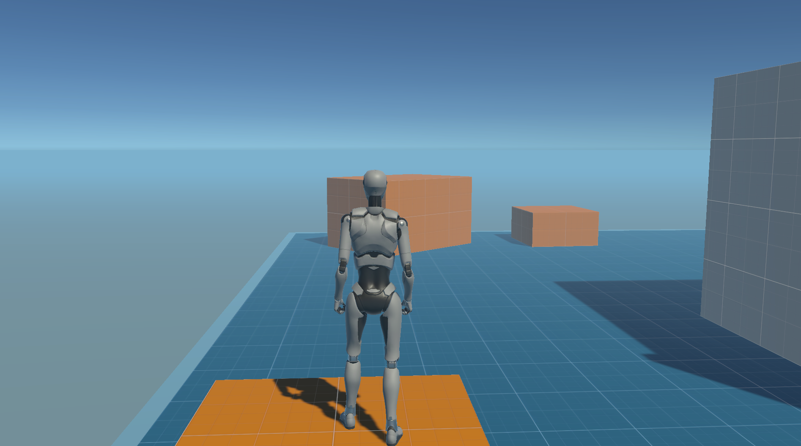

# Teste Unity
Primeiro Teste utilizando o Starter Assets - Third Person Controller do Unity Assets, integrando com a Web.

  

[Clique aqui para acessar](https://testeunity.marcosreisdutra.tech)

## 🚀 Tecnologias

Esse projeto foi desenvolvido com as seguintes tecnologias:

- ``HTML``
- ``Unity3D``
- ``Unity Assets``

## Contato

| [ Marcos Reis Dutra](https://github.com/Marqueba)
